# ThinkAgent 业务流程图

## 一、系统全局业务流程

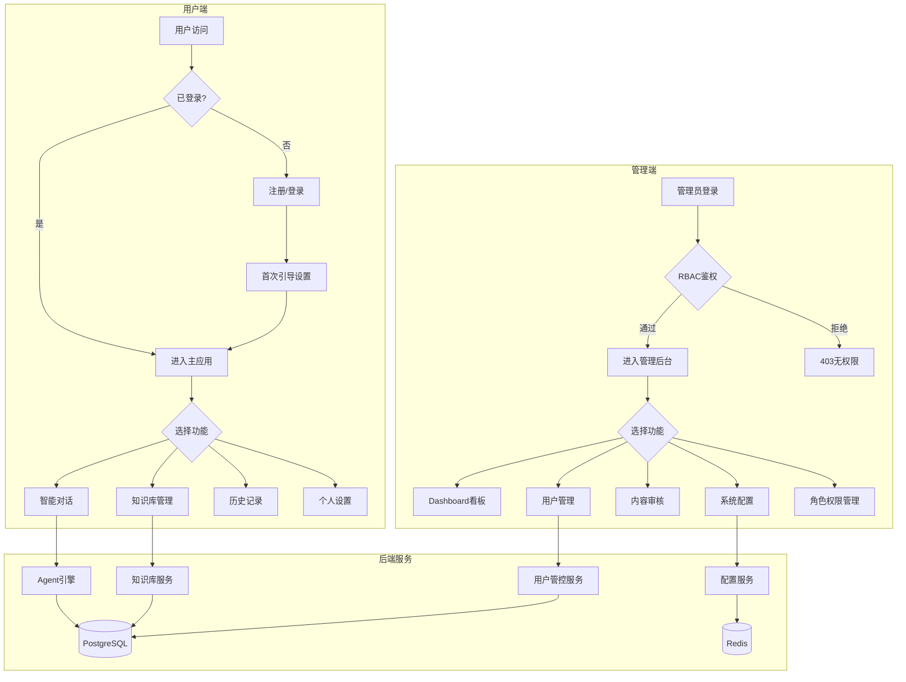

---

## 二、用户注册/登录流程

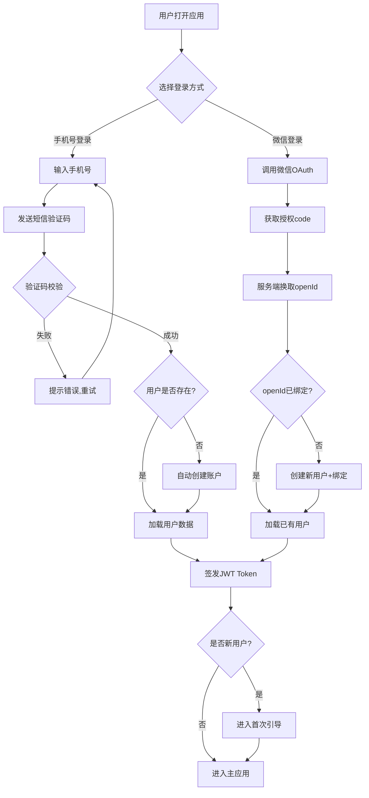

---

## 三、智能对话核心流程

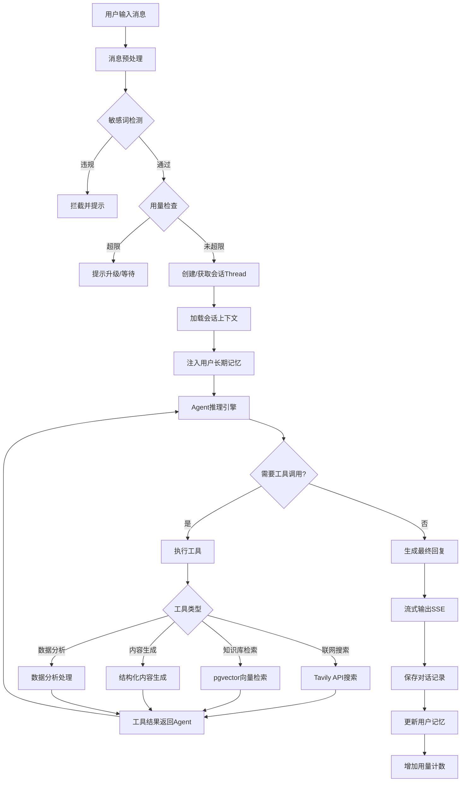

---

## 四、知识库文档处理流程

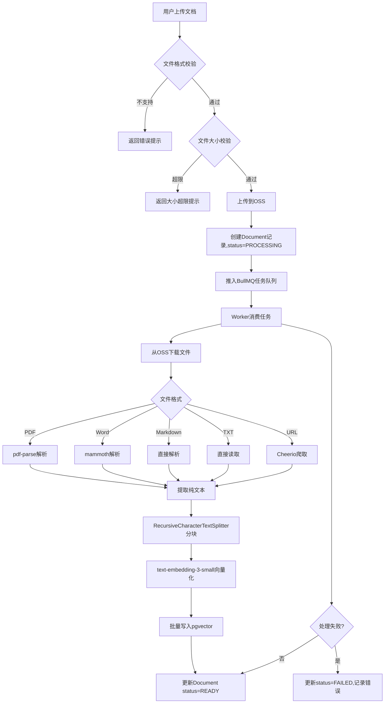

---

## 五、RAG 知识库检索问答流程

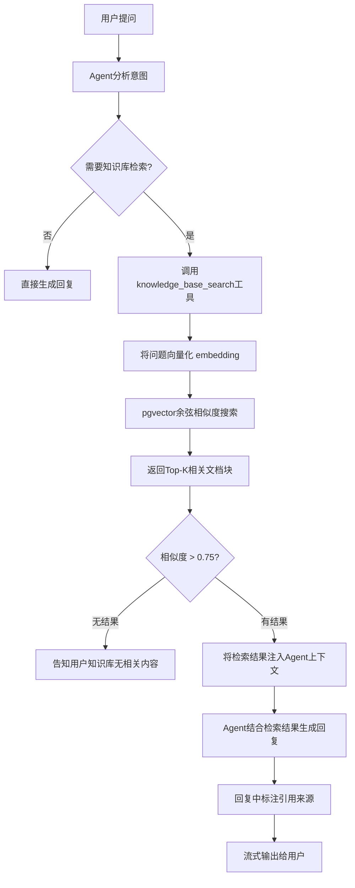

---

## 六、管理员登录与 RBAC 鉴权流程

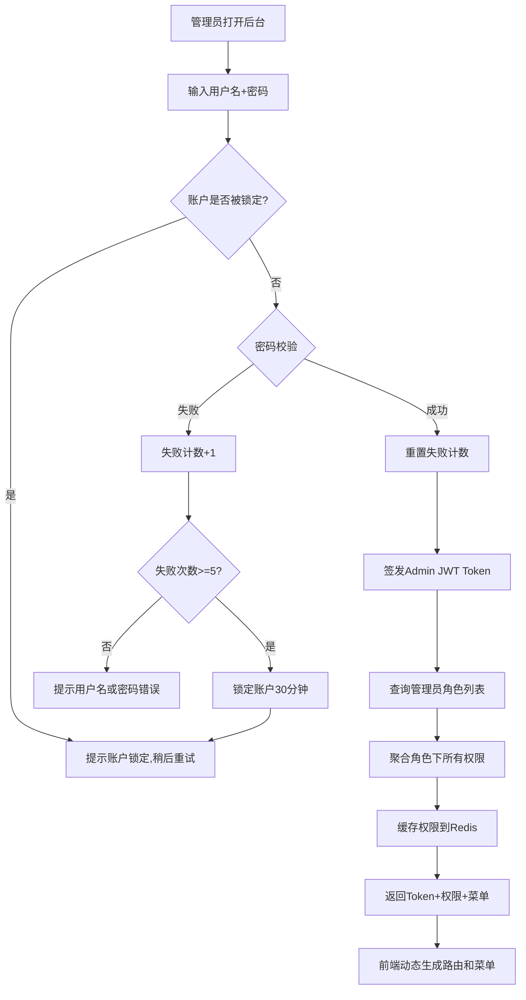

---

## 七、管理员操作权限校验流程

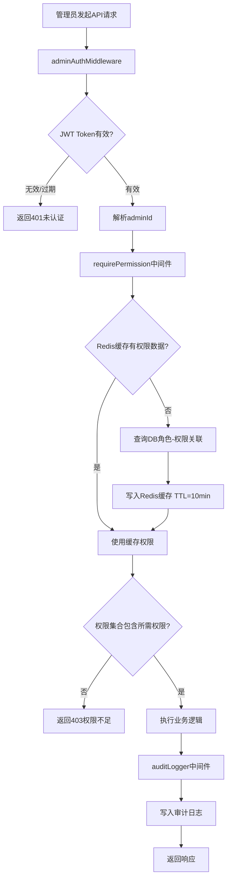

---

## 八、用户使用控制流程（管理端配额管理）

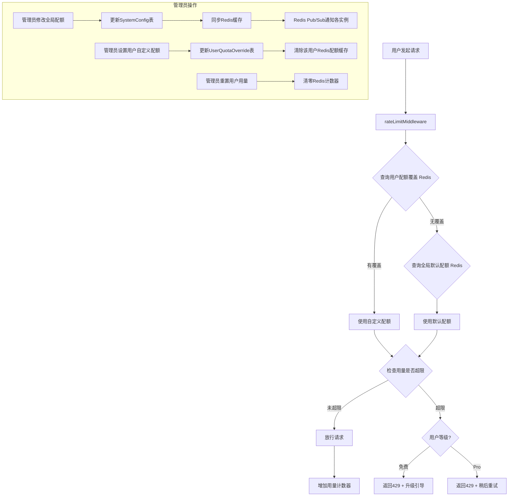

---

## 九、内容审核流程

```mermaid
flowchart TD
    A[用户消息/AI回复] --> B[contentFilterMiddleware]
    B --> C{自动检测结果}
    C -->|置信度>=0.9 明确违规| D[自动拦截,不返回用户]
    D --> E[记录到ContentFlag表]
    C -->|0.6<=置信度<0.9 疑似违规| F[正常返回用户]
    F --> G[推入人工审核队列]
    G --> H[ContentFlag status=PENDING]
    C -->|置信度<0.6 正常| I[正常返回用户]

    subgraph 人工审核(管理后台)
        H --> J[审核员查看审核队列]
        J --> K{审核结论}
        K -->|通过| L[标记APPROVED]
        K -->|违规-仅删除| M[删除内容]
        K -->|违规-删除+警告| N[删除内容 + 警告用户]
        K -->|违规-删除+封禁| O[删除内容 + 禁用用户账户]
    end
```

---

## 十、订阅与付费流程

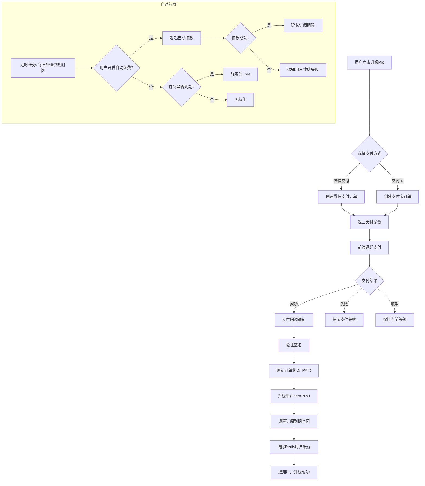

---

## 十一、系统配置热加载流程

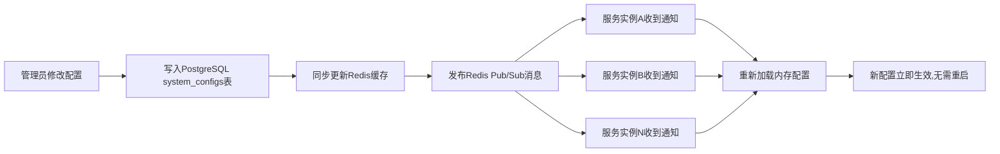

---

## 十二、完整用户旅程业务流程

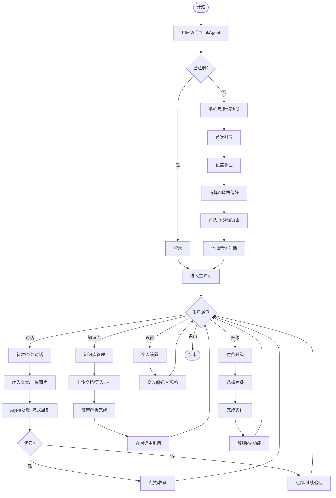
