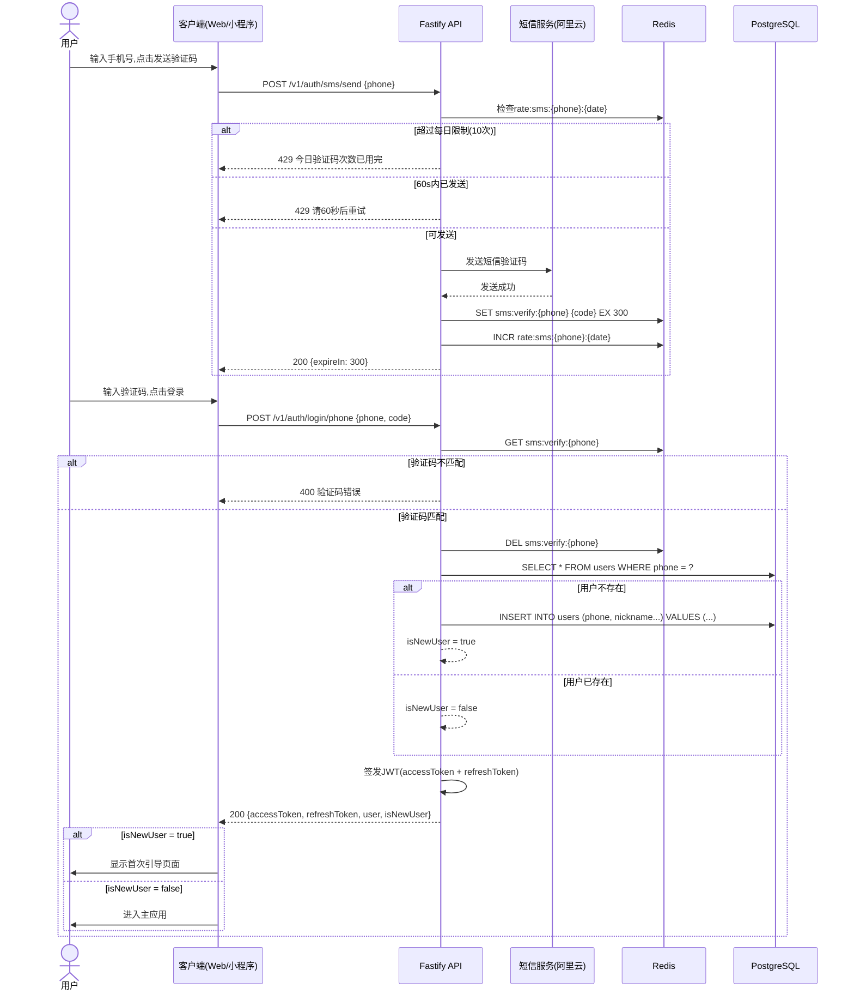
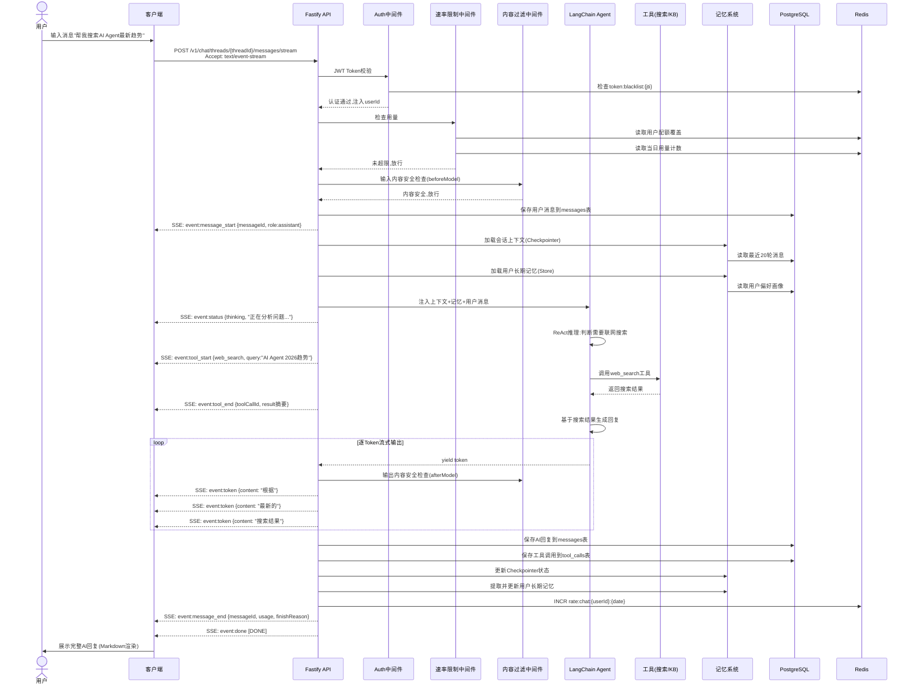
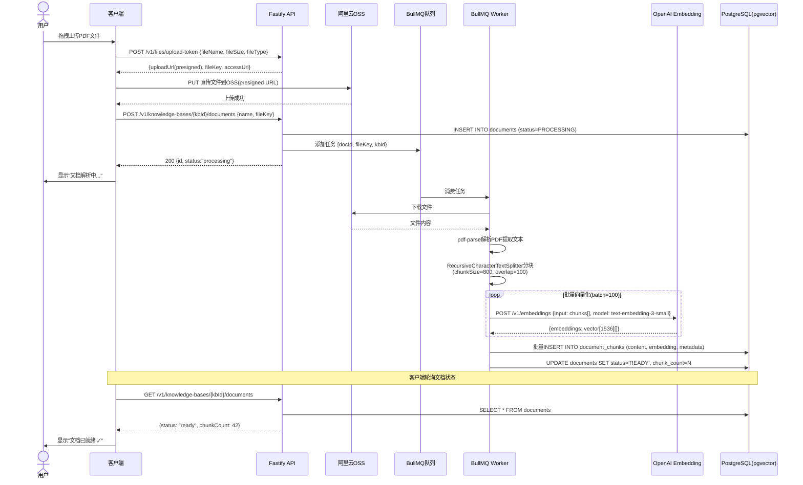
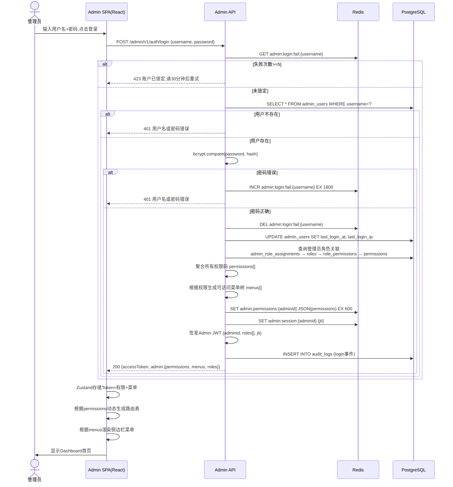
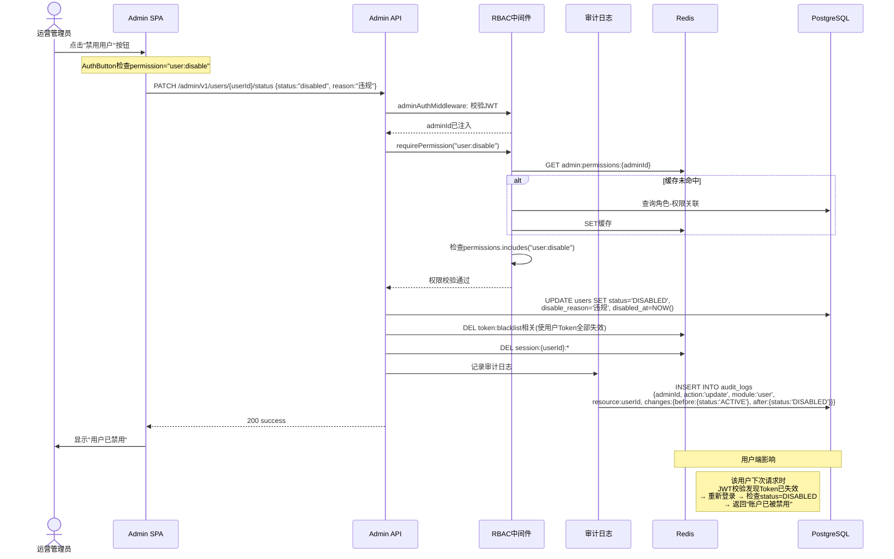
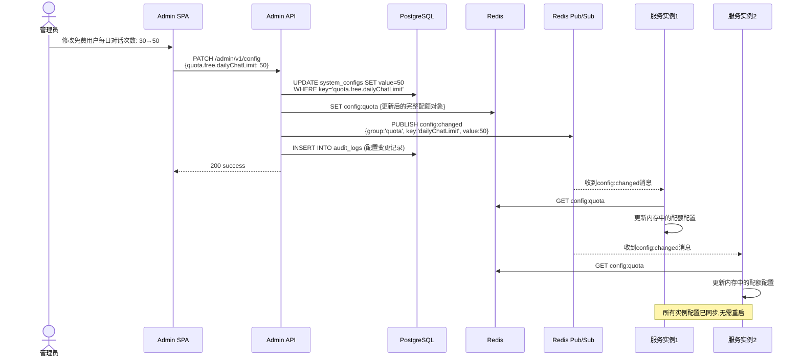
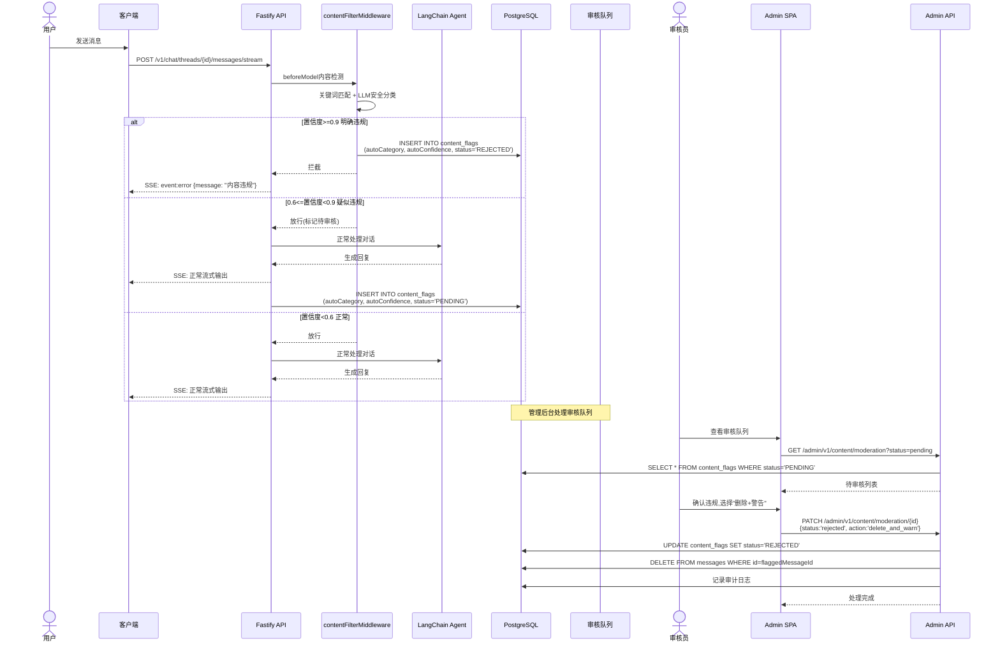
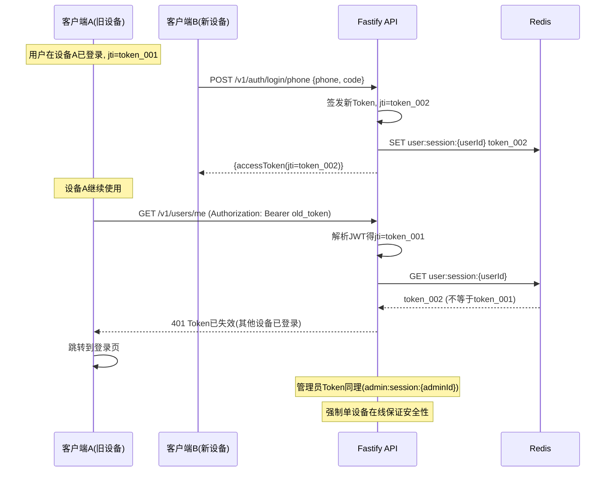
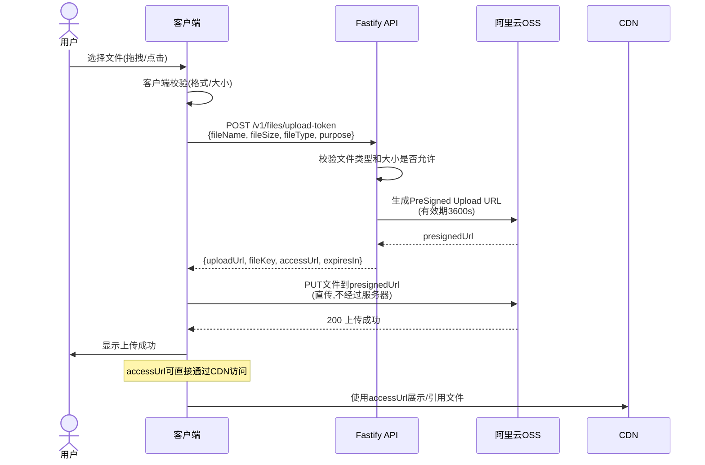
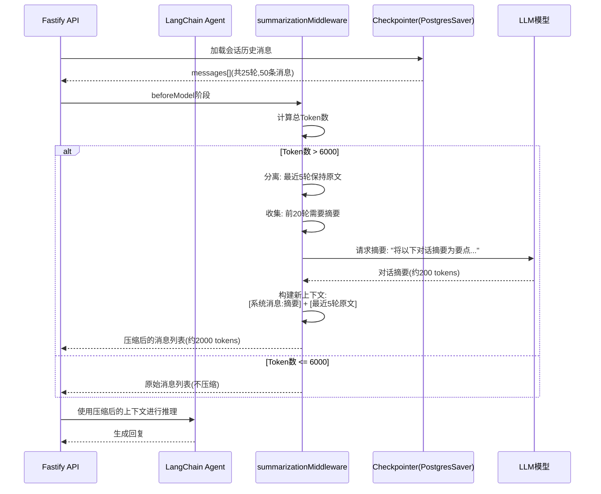

# ThinkAgent 时序图

## 一、用户手机号登录时序图

---

## 二、智能对话流式输出时序图

---

## 三、知识库文档上传与处理时序图

---

## 四、管理员登录与RBAC权限加载时序图

---

## 五、管理员操作用户管控时序图

---

## 六、系统配置热更新时序图

---

## 七、内容审核处理时序图

---

## 八、Token刷新与单设备在线时序图

---

## 九、文件上传(OSS直传)时序图

---

## 十、对话摘要自动压缩时序图

